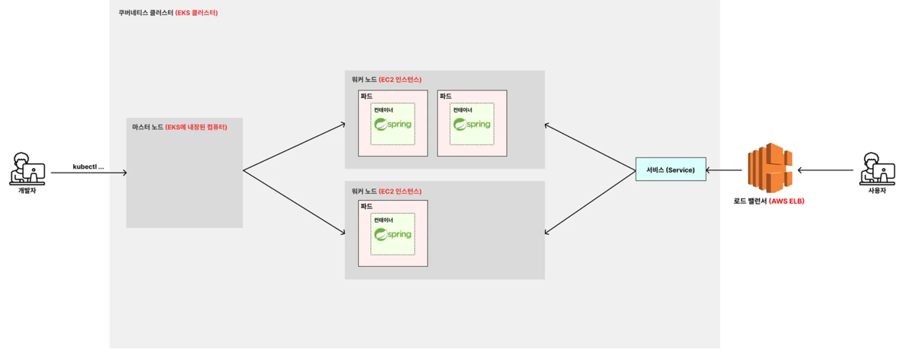

### Service
- 클라이언트 요청을 nodePort(30000) -> 서비스 Port (8080) -> Pod Target Port (8080)로 전달 
```yaml
apiVersion: v1
kind: Service

metadata:
  name: spring-service

spec:
  type: NodePort
  selector:
    app: backend-app # Deployment 에 정의된 "backend-app" 레이블을 가진 파드들을 연결
  ports:
    - protocol: TCP
      port: 8080
      targetPort: 8080
      nodePort: 30000
```


### PVC(Persistent Volume Claim)
- Pod 에서 바로 PV(Persistent Volume)을 접근하는 것이 아니라 PVC를 통해 PV를 접근


### Spring Boot <-> Mysql
- env에 my-service를 넣어주면 mysql-service로 매핑 (mysql-service의 nodePort)
```yaml
          env:
            - name: DB_HOST
              value: mysql-service #localhost:30002와 매핑해줌 (nodePort)
```


### Mysql 외부 Port 막기
- Service Type을 ClusterIP로 설정하면 외부에서 접근 불가능
```yaml
spec:
  type: ClusterIP
  selector:
      app: mysql-db
  ports:
    - protocol: TCP
      port: 3306
      targetPort: 3306
      # nodePort  제거

```

- 외부에서 DB 접근해야할 경우, 포트포워드 사용
```shell
$ kubectl port-forward pod/mysql-deployment-7cf6d744-v8nlz 3306:3306
```


### k8s에서 ECR 이미지 pull 권한 Secret 생성
- k8s가 AWS ECR의 이미지를 pull 받을 수 있는 Secret 생성 
```shell
& kubectl create secret generic regcred --from-file=.dockerconfigjson=/home/ubuntu/.docker/config.json --type=kubernetes.io/dockerconfigjson
```

### EKS Architecture
- 클러스터 = 마스터노드 + 워커노드(N개)
  - 마스터 노드 : 클러스터 전체를 관리하는 서버 (개발자의 kubectl 등의 명령어 받는 서버)
  - 워커 노드 : 실제 파드를 띄우는 서버 (마스터의 명령을 받고 서비스르를 띄운다)
- 서비스(Service)
  - ELB에서 온 요청을 각각의 워커노드로 보내는 역할
- 외부 ELB 
  - 사용자들의 요청을 분배하고 서비스로 보내는 역할

