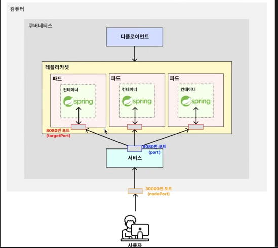
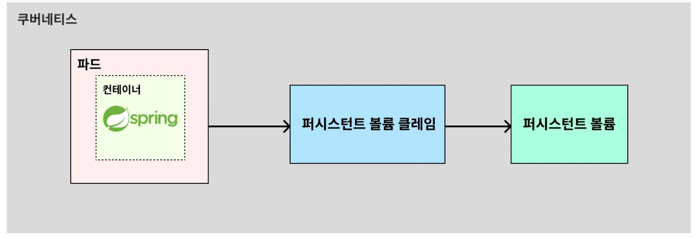
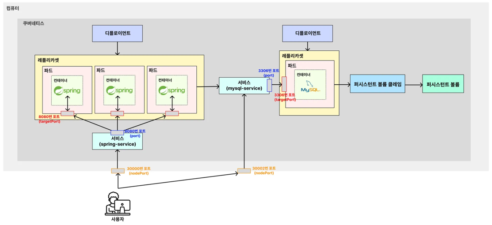

### Service
- 클라이언트 요청을 nodePort(30000) -> 서비스 Port (8080) -> Pod Target Port (8080)로 전달 
```yaml
apiVersion: v1
kind: Service

metadata:
  name: spring-service

spec:
  type: NodePort
  selector:
    app: backend-app # Deployment 에 정의된 "backend-app" 레이블을 가진 파드들을 연결
  ports:
    - protocol: TCP
      port: 8080
      targetPort: 8080
      nodePort: 30000
```



### PVC(Persistent Volume Claim)
- Pod 에서 바로 PV(Persistent Volume)을 접근하는 것이 아니라 PVC를 통해 PV를 접근




### Spring Boot <-> Mysql
- env에 my-service를 넣어주면 mysql-service로 매핑 (mysql-service의 nodePort)
```yaml
          env:
            - name: DB_HOST
              value: mysql-service #localhost:30002와 매핑해줌 (nodePort)
```
